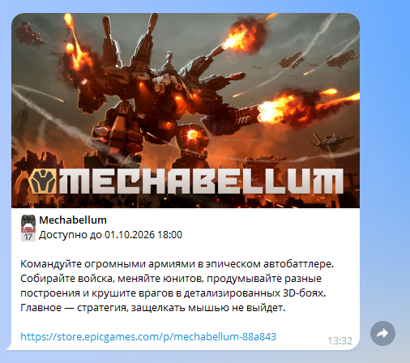

# Epic Games Store Telegram-бот
Telegram-бот, который отправляет уведомления своим подписчикам о раздачах бесплатных игр в магазине цифровых товаров [Epic Games Store](https://store.epicgames.com/).
Отслеживание актуальных раздач реализуется с помощью планировщика, совершающего периодические HTTP-запросы к API Epic Games Store и планирующего отправку уведомлений боту.
Как только игра становится доступна для получения в магазине, пользователь получает сообщение с её описанием.

Для выбора языка, региона и часового пояса необходимо изменить параметры в файле `src/config.py`.



## Технологический стэк
`Python 3.12`, `Aiogram 3`, `APScheduler`, `SQLite`, `SQLAlchemy`, `Pydantic`

## Инструкция по запуску
Находясь в корневой директории проекта, выполните команду:
```bash
cp .env.example .env
```
Заполните значение переменной `BOT_TOKEN` в файле `.env`. О том, как получить значение токена, можно прочитать [здесь](https://core.telegram.org/bots/features#creating-a-new-bot).

Команда ниже позволит запустить Telegram-бота и планировщик:
```bash
docker compose up --build
```
